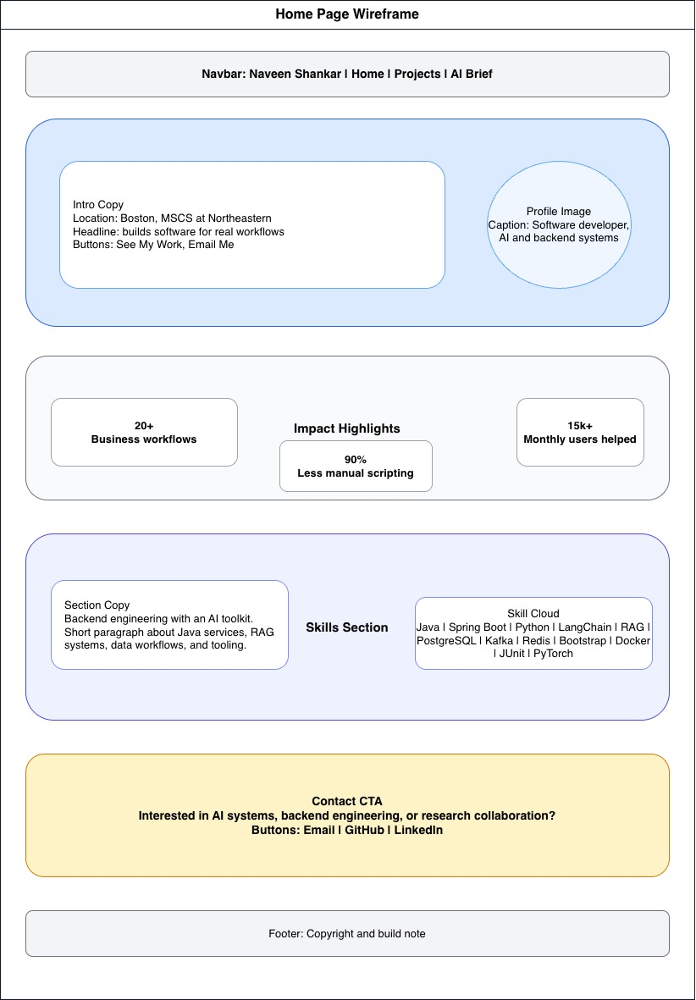
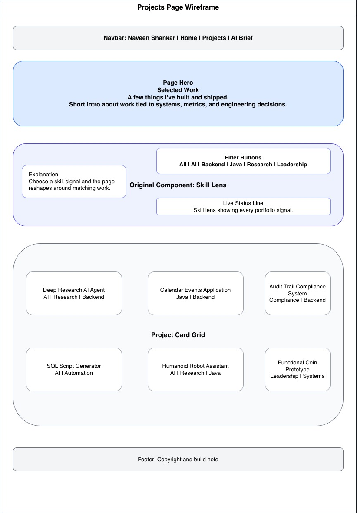
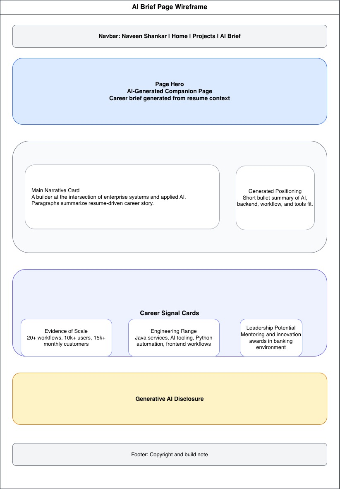

# Portfolio Homepage Design Document

## Project Description

The portfolio homepage introduces Naveen Shankar as a software developer and MS Computer Science
student focused on applied AI, backend systems, and research-driven engineering. The site is
intentionally static and lightweight, using semantic HTML, Bootstrap grid utilities, a custom CSS
layer, and ES6 JavaScript modules.

The project is designed as a professional landing page rather than a generic biography. Every page
answers a likely visitor question: who Naveen is, what kind of work he has done, what technical
signals matter most, and how to contact him. The content is based on resume evidence, with metrics
and concrete project names used wherever possible so the page feels credible and useful.

The core design goals are:

- Present meaningful resume-driven content quickly.
- Make projects and experience easy to scan.
- Include an original interactive component without adding a framework.
- Provide a clearly labeled AI-generated companion page.
- Keep the implementation accessible, responsive, and easy to evaluate against the assignment
  requirements.
- Use a visual identity that feels technical and modern without distracting from the portfolio
  content.

The site contains three public-facing HTML pages:

- `index.html`: the main homepage with an introduction, impact metrics, skills, and contact links.
- `projects.html`: a project-focused page with the original "Skill Lens" filtering component.
- `ai.html`: an AI-generated companion page that summarizes the career story and discloses AI use.

## User Personas

### Recruiter

A technical recruiter wants a quick summary of Naveen's background, core skills, measurable impact,
and contact links. They need the homepage to communicate fit within the first minute.

Needs:

- A clear headline explaining Naveen's role and focus.
- Fast access to education, experience, skills, GitHub, LinkedIn, and email.
- Evidence that the profile is current and relevant to software engineering roles.

Design response:

- The hero section states the professional positioning immediately.
- Impact tiles summarize measurable outcomes such as supported workflows, reduced manual scripting,
  and users helped.
- Contact actions are placed both near the top and near the bottom of the homepage.

### Engineering Manager

An engineering manager wants evidence that Naveen can build production systems, work with AI tools
responsibly, and deliver measurable business value. They will likely inspect the projects page for
depth and technical range.

Needs:

- Proof of technical depth beyond a list of tools.
- Project descriptions tied to engineering decisions, systems, and outcomes.
- A way to scan for relevant skill areas such as AI, backend, Java, research, and leadership.

Design response:

- The projects page describes each item with technologies, architecture cues, and outcomes.
- The Skill Lens lets managers filter portfolio evidence by skill signal.
- The AI companion page frames the work as a coherent career narrative rather than isolated tasks.

### Peer Or General Visitor

A peer, professor, or general visitor may not be evaluating Naveen for a job but still wants to
understand the site quickly and move between pages without confusion.

Needs:

- Straightforward navigation.
- Clear page titles and section headings.
- A readable layout on both phone and desktop screens.

Design response:

- The navigation is consistent across all pages.
- Each page has one main purpose and a distinct hero section.
- Bootstrap's responsive grid is combined with custom CSS so cards, skill tags, and call-to-action
  areas remain readable across viewport sizes.

## User Stories

- As a recruiter reviewing candidates quickly, I want the homepage hero to tell me Naveen's current
  role, location, technical focus, and contact path so I can decide whether to continue reading.
- As a recruiter comparing several resumes, I want to see a few measurable outcomes from Naveen's
  work so I can understand the scale of his experience without opening a separate resume file.
- As an engineering manager hiring for backend or AI work, I want project cards that pair
  technologies with outcomes so I can judge whether the experience is relevant to my team.
- As an engineering manager scanning for a specific skill, I want to filter the project list by AI,
  backend, Java, research, or leadership so I can skip unrelated examples.
- As a professor or peer reviewing the portfolio, I want the AI-generated page to be clearly labeled
  and disclosed so I can distinguish the main portfolio content from AI-assisted writing.
- As a collaborator deciding whether to reach out, I want the contact section to connect Naveen's
  interests with email, GitHub, and LinkedIn links so I have a clear next step.

## Wireframes

The wireframes below show the planned layout for each public-facing page in the portfolio.

### Home Page

### Projects Page

### AI Brief Page

