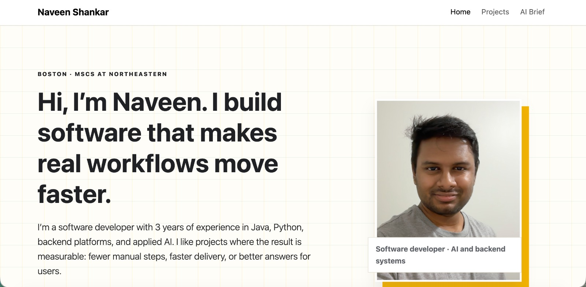

# Naveen Shankar Portfolio Homepage

Author: Naveen Shankar

Course: Web Development (CS 5610), MS CS at Northeastern University, Boston

Public project page: <https://naveen-shankar-homepage.netlify.app/>

Class link: <https://johnguerra.co/classes/webDevelopment_online_summer_2026/>

## Project Objective

This project is a static personal homepage built with vanilla HTML5, CSS3, Bootstrap 5 utilities,
and ES6 modules. It presents Naveen Shankar's software engineering background, selected projects,
technical skills, and an AI-generated career brief.

The site includes:

- `index.html`: homepage with profile summary, impact metrics, skills, and contact links.
- `projects.html`: project and experience portfolio with Naveen's Skill Lens, an original JavaScript
  filter that maps work to skill signals.
- `ai.html`: AI-generated companion page clearly labeled as generative content.
- `design.md`: design document with project description, user personas, user stories, wireframes,
  and screenshots required by the assignment.

## Creative Addition

The creative addition in this homepage is **Naveen's Skill Lens** on `projects.html`. It is an
original ES6 module interaction that lets visitors filter portfolio cards by skill signals such as
AI, Backend, Java, Research, and Leadership.

Instead of showing projects as a static list, the Skill Lens lets a visitor explore the same
resume-backed work from different angles. When a filter is selected, matching project cards remain
visible and the live status text updates to summarize the selected signal. This differentiates the
portfolio while staying lightweight and understandable for a static HTML/CSS/JavaScript site.

## Screenshot



## Build And Run Instructions

Install development dependencies:

```bash
npm install
```

Format the project:

```bash
npm run format
```

Lint JavaScript modules:

```bash
npm run lint
```

Run locally with any static server. One option is:

```bash
npx serve .
```

Then open the local URL shown in the terminal.

## Design Document

The design document is available in `design.md`. It includes the required project description,
personas, user stories, design mockups/wireframes, and screenshots that explain the portfolio's
layout and interaction decisions.

## Demo Video

Public narrated demo video: `[Add video link here]`

## GenAI Disclosure

I leveraged Cursor's Plan mode with the GPT-5.5 model to create an AI HTML generation plan,
included in `docs/ai-generated-companion-page/ai-html-generation-plan.md`, using my resume as the
factual context. The plan asked the model to generate a third AI companion page that matched the
existing `index.html` and `projects.html` structure, reused the existing assets and styles,
highlighted resume-backed metrics, and included a clear AI-use disclosure. I then executed that plan
to create `ai.html`.

## License

This project uses the MIT License. See `LICENSE` for details.
